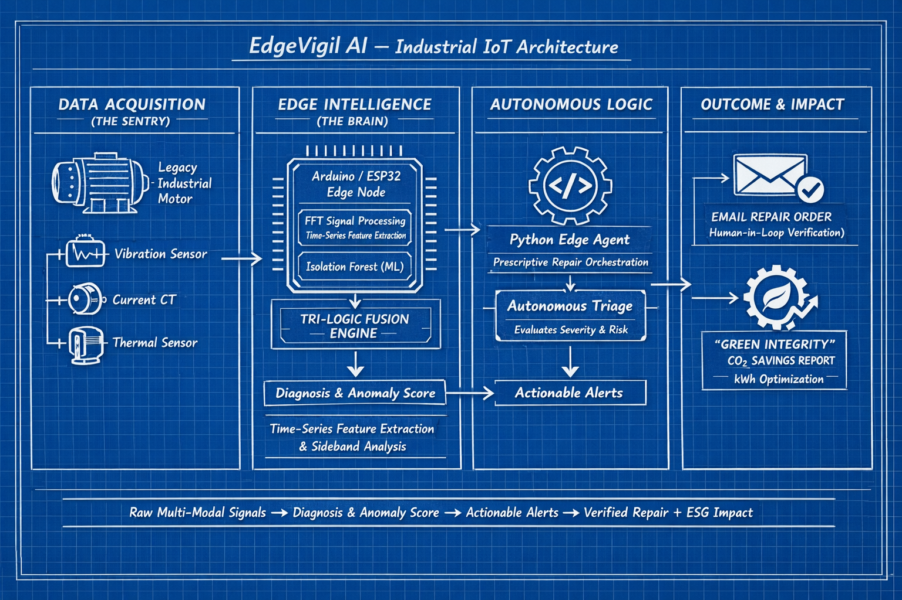

# EdgeVigil AI: Autonomous Prescriptive Maintenance
### **Bridging the Gap Between Legacy Industrial Assets & Edge Intelligence**
**National Level Hackathon Entry - GRASP 2026**


<br>
*Figure 1: Data flow from Arduino Sentry Nodes to Python Edge Agents and Autonomous Repair Orchestration.*

---

## 🚀 Project Overview
EdgeVigil AI is an **Edge-Native Intelligence Layer** designed to retrofit legacy 30-year-old machinery into "Smart Nodes". Unlike cloud-dependent tools, EdgeVigil processes vibration, current, and thermal signatures locally to deliver real-time prescriptive actions, ensuring zero unplanned downtime.

## 🧠 Core Innovation: Tri-Logic Fusion
Our system uses a multi-layered approach to ensure high-fidelity fault detection:
1. **Signal Processing:** Fast Fourier Transform (FFT) for frequency-domain fault classification.
2. **Anomaly Detection:** Isolation Forests for unsupervised learning, adapting to environmental noise without manual thresholds.
3. **Prescription Engine:** Autonomous orchestration that converts diagnosis into actionable repair workflows locally at the Edge.

## ⚙️ Features & Tech Stack
* **Multi-Modal Sensing:** Fuses Vibration, Current, and Temperature signatures.
* **Green Integrity:** Integrated CO₂ tracking that calculates carbon savings per prevented failure.
* **Prescriptive Alerts:** Automatically drafts repair orders with required parts and safety protocols.
* **Tech Stack:** Python 3.9+, Scikit-Learn (AI), Arduino/ESP32 (Hardware), NumPy (Signals).

---

## 📊 Live System Demo
Below is the real-time output from the EdgeVigil AI Brain during a simulated bearing failure, showing the **Green Integrity** carbon tracking in action:


---

## ⚡ Functional Testing & Proof of Life
To verify the system's accuracy, run the simulation logic:

### **Test Scenario: Bearing Failure Detection**
* **Expected Result:** System detects high-frequency "Haystack" noise and sudden thermal rise.
* **Observation:** Terminal outputs: `>>> 🚨 CRITICAL ANOMALY DETECTED!` along with the **Green Integrity** CO₂ savings report.

## 🛠️ How to Run Locally

```bash
# 1. Clone the repository
git clone [https://github.com/mariannoah16-svg/EdgeVigil_AI.git](https://github.com/mariannoah16-svg/EdgeVigil_AI.git)

# 2. Navigate to the project folder
cd EdgeVigil_AI

# 3. Install the required AI libraries
pip install -r requirements.txt

# 4. Run the Edge Intelligence Brain
python edge_vigil_core.py
